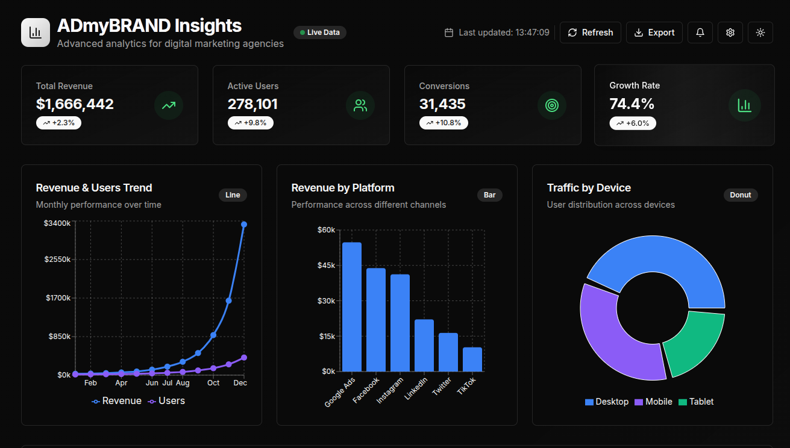
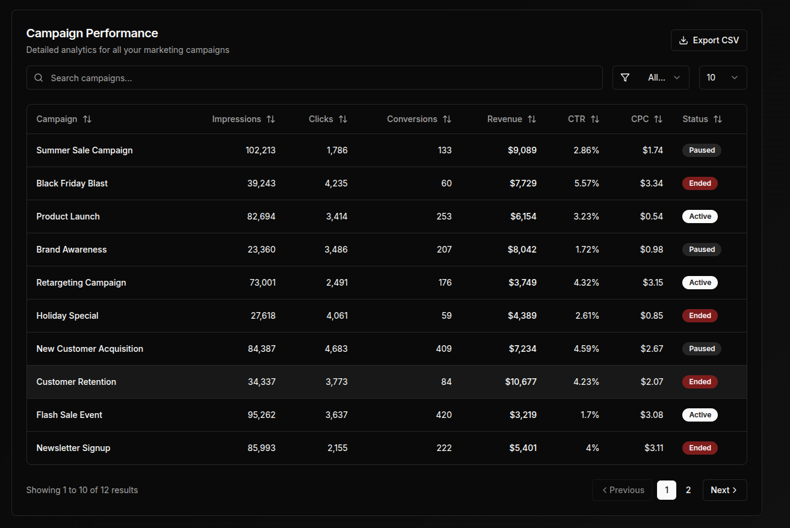

# 🚀 ADmyBRAND Insights - AI-Powered Analytics Dashboard

**Advanced analytics dashboard for digital marketing agencies. Built with Next.js, TailwindCSS, and shadcn/ui.**  

🌐 **Live Demo:** [https://next-js-analytics-dashboard.vercel.app/](https://next-js-analytics-dashboard.vercel.app/)




---

## 📊 Overview

**ADmyBRAND Insights** is a modern and responsive analytics dashboard designed for marketing agencies. It showcases real-time metrics, interactive charts, and a beautiful UI that adapts across devices.

### ✅ Key Features

- **📈 Overview Cards**  
  Total Revenue, Active Users, Conversions, and Growth Rate KPIs.

- **📊 Interactive Visualizations**  
  - Line Chart: Revenue & Users over time  
  - Bar Chart: Revenue by Platform  
  - Donut Chart: Traffic by Device

- **📋 Campaign Performance Table**  
  - Sorting, Filtering, Pagination  
  - Export to CSV  
  - Searchable and filterable UI

- **🌓 Dark/Light Mode Toggle**  
  Powered by `theme-provider.tsx` and Tailwind theming.

- **⚡ Real-Time Simulation**  
  Data refreshes using simulated live data intervals.

---

## 🛠️ Tech Stack

| Tech              | Usage                                  |
|-------------------|----------------------------------------|
| **Next.js 14+**   | App Router, modern SSR                 |
| **React 18+**     | Component-based architecture           |
| **Tailwind CSS**  | Utility-first styling framework        |
| **shadcn/ui**     | Reusable accessible components         |
| **TypeScript**    | Type-safe development                  |
| **Recharts**      | Line, Bar, and Donut charts            |
| **Lucide Icons**  | Beautiful iconography                  |

---

## 📁 Project Structure

```
.
├── app/
│   ├── layout.tsx        // App layout
│   ├── page.tsx          // Entry dashboard page
│   └── globals.css       // Tailwind CSS setup
├── components/
│   └── dashboard/
│       ├── analytics-chart.tsx
│       ├── dashboard-header.tsx
│       ├── data-table.tsx
│       └── metric-card.tsx
├── lib/
│   ├── mock-data.ts      // Simulated data
│   └── utils.ts
├── hooks/
│   └── use-toast.ts      // Toast notification hook
├── ui/
│   └── theme-provider.tsx
├── public/
│   ├── preview1.png       // Dashboard screenshot
│   └── preview2.png
├── tailwind.config.ts
├── postcss.config.js
└── tsconfig.json
```

---

## 📦 Getting Started

### 1. Clone the Repo

```bash
git clone https://github.com/chetaniitbhilai/NextJS-Analytics-Dashboard.git
cd NextJS-Analytics-Dashboard
```

### 2. Install Dependencies

```bash
npm install
# or
yarn install
```

### 3. Run the Dev Server

```bash
npm run dev
# or
yarn dev
```

Visit [http://localhost:3000](http://localhost:3000) in your browser.

---

## 🌟 Bonus Features

- ⏱ Real-Time Data Simulation (`setInterval`)
- 📤 Export to CSV functionality
- 🔍 Advanced filtering & campaign search
- 💅 Smooth micro-animations & hover effects
- 💡 Dark/Light theme toggle

---

## 🧠 Inspiration

This project is part of **Task A** in a Frontend Development Showcase Challenge. It demonstrates best practices in UI/UX, charting, and analytics dashboard architecture.

---

## 📸 Screenshots

<details>
  <summary>📊 Dashboard Preview</summary>
  
  
</details>

---

## 📝 License

MIT — feel free to fork, modify, and use this project.